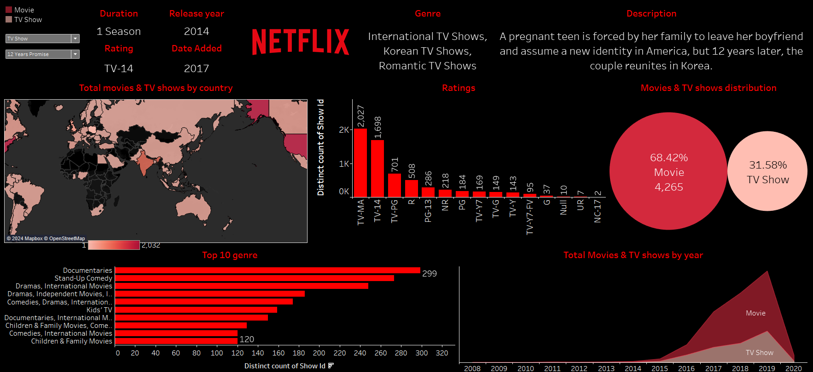
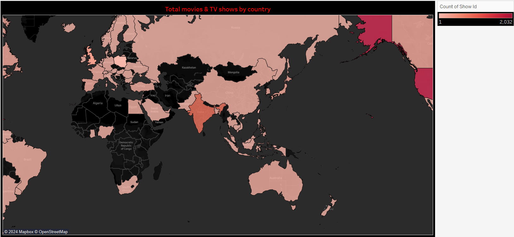
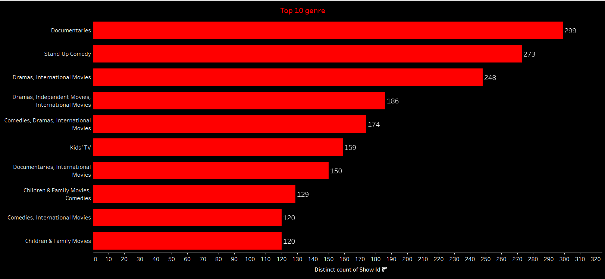
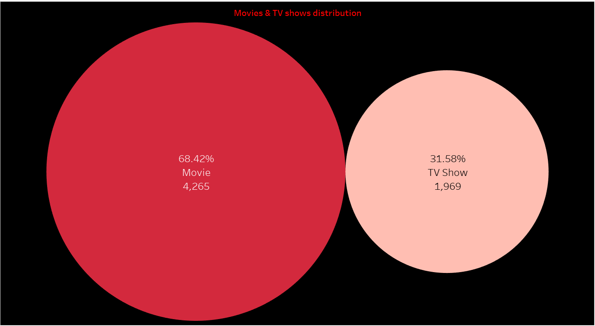
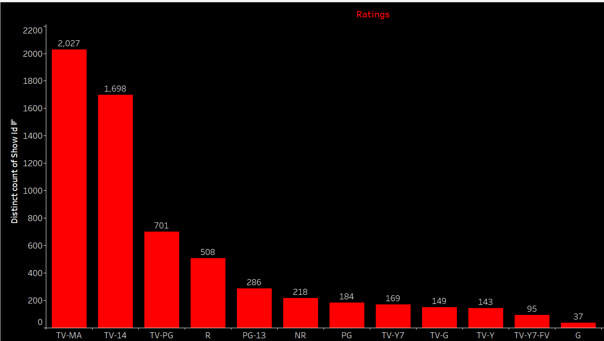

# **Netflix Content Trends Analysis**
---

## **Project Overview**
This project analyzes Netflix’s content library to identify trends and viewer preferences, leveraging Tableau for data visualization. The aim is to uncover actionable insights that can inform strategic decision-making, focusing on:
- Production patterns
- Regional contributions
- Popular genres
- Audience demographics

---

## **Key Business Questions**
1. **How have Netflix’s movie and TV show productions evolved over time?**
2. **Which regions contribute most significantly to Netflix’s content library?**
3. **What are the top-performing genres globally?**
4. **How are content ratings distributed, and what do they reveal about Netflix’s target audience?**

---

## **Methodology**

### **Data Source**
- [Netflix Content Dataset](https://github.com/chaitali-khadse/Portfolio-project-on-netflix-content-evolution/blob/main/Netflix_Content_Data.csv): Contains information on titles, genres, countries, ratings, and release dates.

### **Tools Used**
- **Python**: Data cleaning and preprocessing
- **Tableau**: Interactive dashboards and visualizations

### **Steps Taken**
1. **Data Cleaning**:
   - Removed duplicates and handled missing values
   - Standardized formats for dates and categorical fields

2. **Exploratory Data Analysis (EDA)**:
   - Investigated key patterns using statistical methods

3. **Visualization**:
   - Created dashboards in Tableau to illustrate trends, distributions, and comparisons

---
## **Netflix Content Trends Analysis**

## **Visualizations**

### **1. Geographical Distribution of Content**
- **Insight**: Heatmap showing the concentration of movies and TV shows by country.

### **2. Genre Preferences**
- **Insight**: Bar chart highlighting the top 10 most common genres.

### **3. Content Type Distribution**
- **Insight**: Pie chart showing the proportion of movies versus TV shows.

### **4. Temporal Trends**
- **Insight**: Line chart illustrating content production growth over time.

---

## **Insights Derived**

### **1. Production Trends**
- Netflix’s content offerings grew significantly post-2015, with movies accounting for 68% of total content.
- This aligns with Netflix’s strategy to dominate the global streaming market.

### **2. Regional Contributions**
- The United States, India, and the United Kingdom are the top contributors to Netflix’s library.
- Regional diversity in genres reflects Netflix’s market-specific strategies.

### **3. Genre Preferences**
- Documentaries and Stand-Up Comedy are the most popular genres, highlighting audience demand for educational and lighthearted content.

### **4. Target Demographics**
- Content ratings show a focus on mature audiences, with TV-14 and TV-MA dominating.

---

## **Results**

### **Strategic Insights**
1. Regional analysis supports market-specific investments.
2. Genre and ratings analysis guide future content development.

### **Actionable Outcomes**
1. Empower Netflix to refine its content strategy based on global trends.
2. Improve engagement through tailored offerings.

---

## **Next Steps**
1. **Incorporate Sentiment Analysis**: Analyze user reviews to understand emotional responses and preferences.
2. **Predictive Analytics**: Use machine learning to forecast future trends in content production and viewer preferences.
3. **Licensing Analysis**: Assess the impact of licensing agreements on regional content availability.

---

## **Artifacts**

- **Interactive Dashboards**: [View Tableau Public Dashboard](path/to/dashboard)
- **Dataset**: [Download Dataset](path/to/dataset.csv)

---

## **Key Skills Demonstrated**

- Data Cleaning and Preparation
- Data Visualization
- Analytical Storytelling
- Tableau Dashboard Design

---

## **GitHub Repository**
Explore the full project and source files: [GitHub Repository](your-repository-link)

---

## **Call to Action**
This project showcases my ability to derive actionable insights through data analysis and visualization.  
Let’s connect to discuss how I can bring value to your team. Feel free to explore the repository or reach out to me for collaborations.

